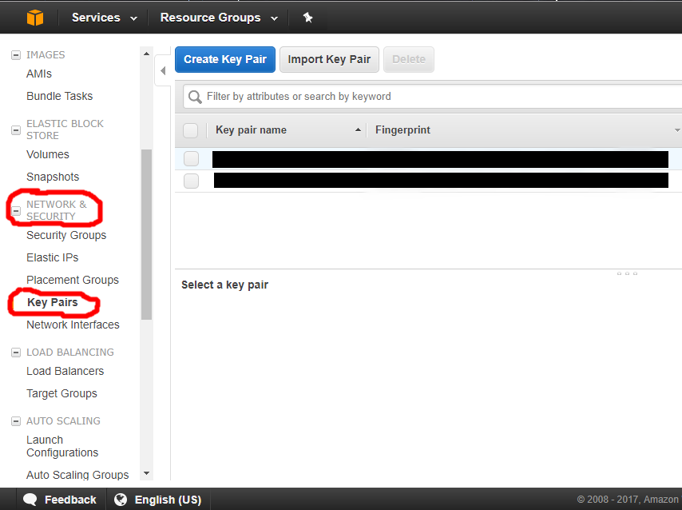
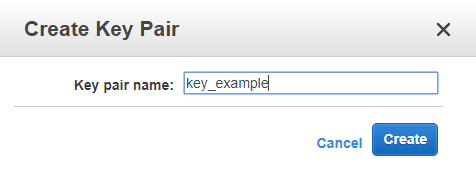
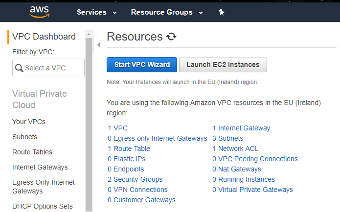
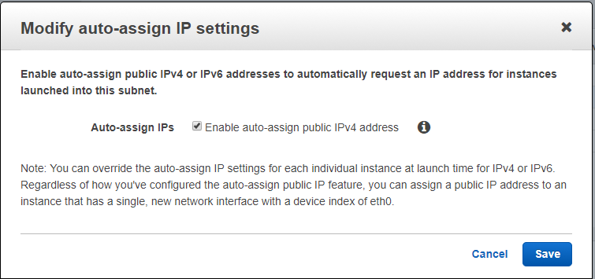

# aws-lambda-r - Configure AWS for production deployment

**Note: these instructions are not complete.** If you are already familiar with AWS,
please review the files in `scripts/` and `settings/`.

These are instructions to be followed before running the scripts. At the end of 
these instruction you should have obtained the values for the following keys:

```
IAM_ACCESS_KEY_ID=""
IAM_SECRET_ACCESS_KEY=""
IAM_LAMBDA_FUNCTION_ROLE=""
EC2_KEY_NAME=""
EC2_KEY_FILE=""
EC2_SUBNET_ID=""
EC2_SECURITY_GROUP_IDS=""
S3_BUCKET=""
API_ID=""
API_RESOURCE_ID=""
API_ALIAS_RESOURCE_ID=""
API_AUTHORIZER_ID=""
API_TOKEN=""
```


## IAM 

IAM manages access to AWS.

1. Create an IAM user account to be used only in conjunction with these scripts
    + retain the values of **ACCESS_KEY_ID** and **SECRET_ACCESS_KEY**
2. Give necessary permissions to this user
    + in general more automation requires more permissions
    + TBD
3. Create roles and policies 
    + attach policies to the roles
    + TBD


## SSH Key

SSH Keys allows access through an SSH tunnel to an AWS EC2 instance.

### Create and save SSH key for EC2 connection

1. Go to AWS Web Console
2. Go to EC2 Service
3. Select **Key Pairs** under **NETWORK & SECURITY** menu. 



4. Press "Create Key Pair" button and give the key a name. When you press the 
"Create" button, the browser will download the key.



5. Open the folder containing downloaded key (a `.pem` file having the same name as the created key)

6. Copy the `.pem` file to:
    - on Windows: `C:\Users\<your_user_Name>/.ssh/` folder 
        + in order to show hidden folders go to Folder Menu > View > Check "Hidden items"
    - on OSX and Linux: `~/.ssh/` 
        + Additional commands might be necessary from terminal:
        + `chmod 700 ~/.ssh`
        + `chmod 400 ~/.ssh/<your_key_file>.pem`
        + other instructions: [1](https://unix.stackexchange.com/a/115860) and 
        [2](http://docs.aws.amazon.com/AWSEC2/latest/UserGuide/AccessingInstancesLinux.html)


## VPC

### Create dedicated VPC 

1. Go to AWS Web Console
2. Select VPC from Services menu
3. From VPC Dashboard, click "Start VPC Wizard".



4. Choose "VPC with a Single Public Subnet" and click the "Select" button.


5. Optionally, fill in VPC name and Subnet name fields (e.g., `aws-lambda-r-vpc` and `aws-lambda-r-subnet`).


6. Click the "Create VPC" button.
7. Make note of Subnet ID (`EC2_SUBNET_ID`)
8. Make note of VPC ID for future reference


### Edit subnet

1. Go to AWS Web Console
2. Select VPC from Services menu
3. From VPC Dashboard, Virtual Private Cloud section, select "Subnets"
4. Select the subnet previously created.
5. From "Subnet Actions" menu, select "Modify auto-assign IP settings" option.


6. Check "Enable auto-assign public IPv4 address".




## Create security group (if not already present)

1. Go to AWS Web Console
2. Select VPC from Services menu
3. From VPC Dashboard, Virtual Private Cloud section, select "Security Groups".
4. Look for the VPC ID of the previously created VPC.
5. If not present, click the "Create Security Group" button.
6. Add an Inboud rule to allow SSH
    + e.g. `SSH  TCP  22  Anywhere (0.0.0.0/0, ::/0)`
7. Make note of the Security Group ID (`EC2_SECURITY_GROUP_IDS`)
8. Optionally, give it a informative name tag (e.g., `aws-lambda-r-sg`)


## LAMBDA

### Create Lambda Authorizer function (automated, see `aws_setup.sh` script)


##  S3 BUCKET


## API GATEWAY

1. Create API (automated, see `aws_setup.sh` script)
2. Create resources (automated, see `aws_setup.sh` script)
3. Create authorizer (automated, see `aws_setup.sh` script)
4. Create stages  
5. Attach role for CloudWatch logging to API
6. Enable CloudWatch Logging on stages
