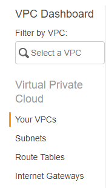
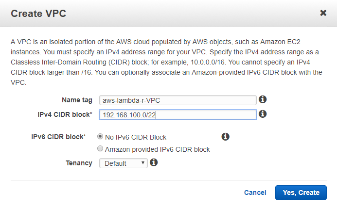
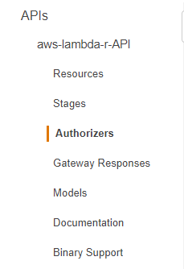

# aws-lambda-r - Configure AWS for production deployment

**Note: the detailed instructions are not complete.** If you are familiar with AWS,
please review the files in `scripts/` and `settings/`.

These are instructions to be followed before running the scripts. At the end of 
these instruction you should have obtained the values for the following keys:

```
IAM_ACCESS_KEY_ID=""
IAM_SECRET_ACCESS_KEY=""
IAM_LAMBDA_FUNCTION_ROLE=""
EC2_KEY_NAME=""
EC2_KEY_FILE=""
EC2_SECURITY_GROUP_IDS=""
EC2_SUBNET_ID=""
S3_BUCKET=""
API_ID=""
API_RESOURCE_ID=""
API_ALIAS_RESOURCE_ID=""
API_AUTHORIZER_ID=""
API_TOKEN=""
```


## IAM 

IAM manages access to AWS.

1. Create an IAM user account to be used only in conjunction with this app
  + retain the values of **ACCESS_KEY_ID** and **SECRET_ACCESS_KEY**
2. Give necessary permissions to this user
  + [TBD: more automation --> more permissions]
3. Create roles and policies 
  + attach policies to the roles


## SSH Key

SSH Keys allows access through an SSH tunnel to a remove / cloud AWS EC2 instance.

### Create and save SSH key for EC2 connection

1. Log in to AWS Console.
2. Go to EC2 Service
3. Select **Key Pairs** under **NETWORK & SECURITY** menu. 


4. Press "Create Key Pair" button and give it a name. When you press the 
"Create" button, the browser will start downloading the key automatically.


5. Open the folder containing downloaded key (a `.pem` file having the same name as the created key)

6. Copy the `.pem` file to:
    - on Windows: `C:\Users\<your_user_Name>/.ssh/` folder 
        + in order to show hidden folders go to Folder Menu > View > Check "Hidden items"
    - on OSX and Linux: `~/.ssh/` Additional commands might be necessary from terminal:
        + `chmod 700 ~/.ssh`
        + `chmod 400 ~/.ssh/<your_key_file>.pem`
        + other instructions: [1](https://unix.stackexchange.com/a/115860) and 
        [2](http://docs.aws.amazon.com/AWSEC2/latest/UserGuide/AccessingInstancesLinux.html)


## VPC

### Create dedicate VPC 

1. Go to AWS Console
2. Select VPC from Services menu
3. From VPC Dashboard,Virtual Private Cloud section, select "Your VPC's"

4. Click on "Create VPC" button

5. Fill name and IPv4 CIDR block in order to define IP range of VPC. 

6. Click the "Yes,Create" button

### Create subnet

1. Go to AWS Console
2. Select VPC from Services menu
3. From VPC Dashboard,Virtual Private Cloud section, select "Subnets"
4. Click on "Create Subnet" button
5. Fill name and IPv4 CIDR block in order to define IP range of Subnet. 

6. Click on "Yes,Create" button

##Create security group


## LAMBDA

### Create Lambda Authorizer function (automated,see `aws_setup.sh` script)


##  S3 BUCKET
### Create S3 bucket (automated,see `aws_setup.sh` script)


## API GATEWAY

1. Create API (automated,see `aws_setup.sh` script)
2. Create resources (automated,see `aws_setup.sh` script)
3. Create authorizer (automated,see `aws_setup.sh` script)
4. Create stages  
5. Attach role for CloudWatch logging to API
6. Enable CloudWatch Logging on stages


## TERMINATE UNUSED INSTANCES

1. Go to AWS web console and select Frankfurt / eu-central-1 region
2. To to EC2 > Instances
3. Select all running instance > Actions button > Instance State > Terminate

# DELETE SERVICES

## VPC
1. Go to AWS Console
2. Select VPC from Services menu
3. From VPC Dashboard,Virtual Private Cloud section, select "Your VPC's"
4. Select the VPC you want to delete
5. Click the "Actions" button 

6. Select "Delete VPC" option

## Subnet
1. Go to AWS Console
2. Select VPC from Services menu
3. From VPC Dashboard,Virtual Private Cloud section, select "Subnets"
4. Select the subnet you want to delete
5. Click on "Actions" button 

6. Select "Delete Subnet" option

## Service Role
1. Go to AWS Console
2. Select IAM from Services menu
3. From IAM Dashboard, select "Roles"

4. Select the role you want to delete 

5. Click on "Delete role" button

## Lambda Function
1. Go to AWS Console
2. Select Lambda from Services menu
3. Select "Functions" from AWS Lambda menu
4. Select the function you want to delete 

5. Click on "Delete" button

## S3 Bucket
1. Go to AWS Console
2. Select S3 from Services menu
3. Select the bucket you want to delete

4. Click the "Delete bucket" button

## API
1. Go to AWS Console
2. Select API Gateway from Services menu
3. Select the API you want to delete
4. Click the "Actions" button
5. Select "Delete API" option


## API Rescources
1. Go to the API that contains the resource you want to delete
2. Select the resource you eant to delete
4. Click the "Actions" button
5. Select "Delete Resource" option


## API Authorizers
1. Go to the API that contains the authorizer you want to delete
2. Select "Authorizers" from the API's menu

3. Click on "Delete Authorizer" button placed in the right corner of 
authorizer description section 


# Create Custom Settings file

[steps needed to create "secrets_user.sh" and "setup_user_secrets.sh" files]
